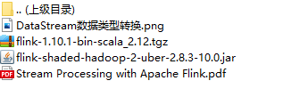
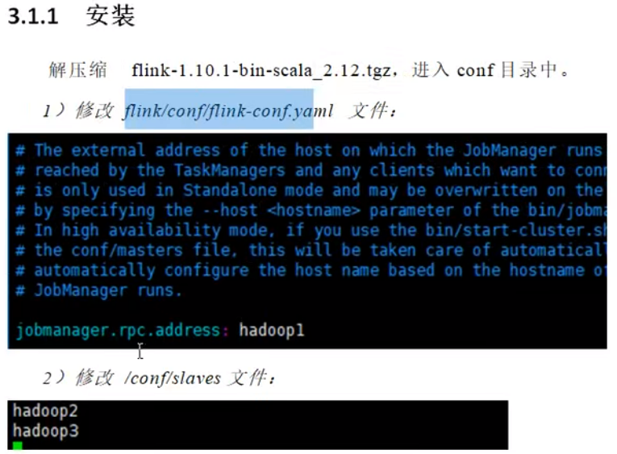
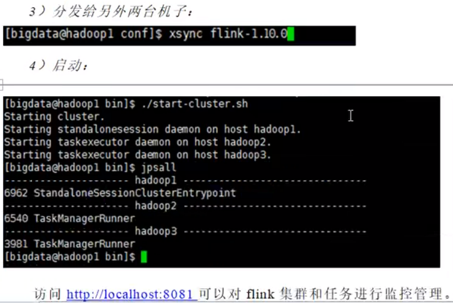

## 资料



## 3.1.1集群安装

master填什么，jobmanager.rpc.address就填什么



#### zookeeper的设置

```

# The number of milliseconds of each tick
tickTime=2000

# The number of ticks that the initial  synchronization phase can take
initLimit=10

# The number of ticks that can pass between  sending a request and getting an acknowledgement
syncLimit=5

# The directory where the snapshot is stored.
dataDir=/opt/module/flink-1.14.0/zkdata

# The port at which the clients will connect
clientPort=2181

# ZooKeeper quorum peers
server.1=hadoop102:2888:3888
server.2=hadoop103:2888:3888
server.3=hadoop104:2888:3888

# server.2=host:peer-port:leader-port
```


